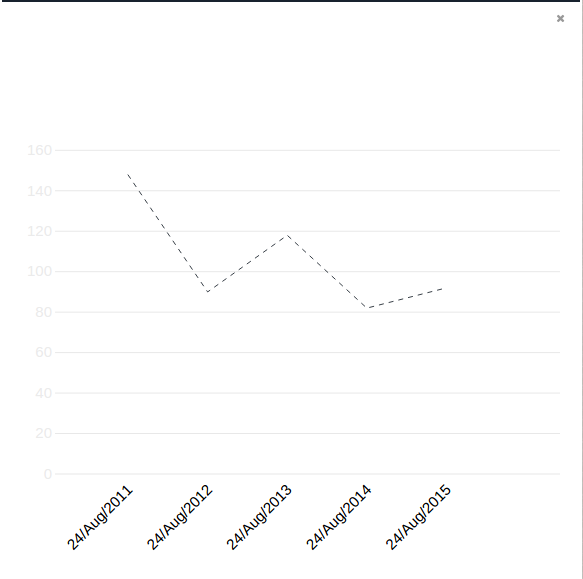
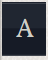
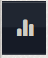
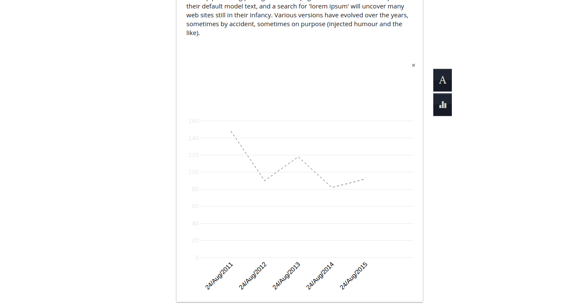

**In-House Coding Challenge**

Welcome! The purpose of this exercise is to get a feel for your coding style and overall approach to development. You don't need to finish all the tasks. In order to start please clone this repo, once you finish email a .zip file (with everything needed to run your implementation) to hello@weareinhouse.com
There are several areas we'll be focusing during this challenge:

1. **D3.JS**
 - You will find a LineChart component. This component is incomplete. You must fix any errors/incompletions in order for the LineChart to render correctly based on the data provided on the same file.
 - It'd be awesome if the LineChart component could be responsive.

2. **REACT.JS**
 - Throughout the challenge you'll be expected to code using ES6

3. **React-Redux**
 - We've added some actions we think you'll find easy to implement. Feel free to add as many as you'd like.

4. **General ability to implement design**
<ul>
<li>All the main components seems to be missing any kind of style. This is 2016, how about we give them some pizazz?
  <ul>
<li>Chart

</li>
<li>
Add Text Button

</li>
<li>Add Graph Button

</li>
<li>General Design Guidelines for the Builder Component

</li>
</ul>
</li>
</ul>
